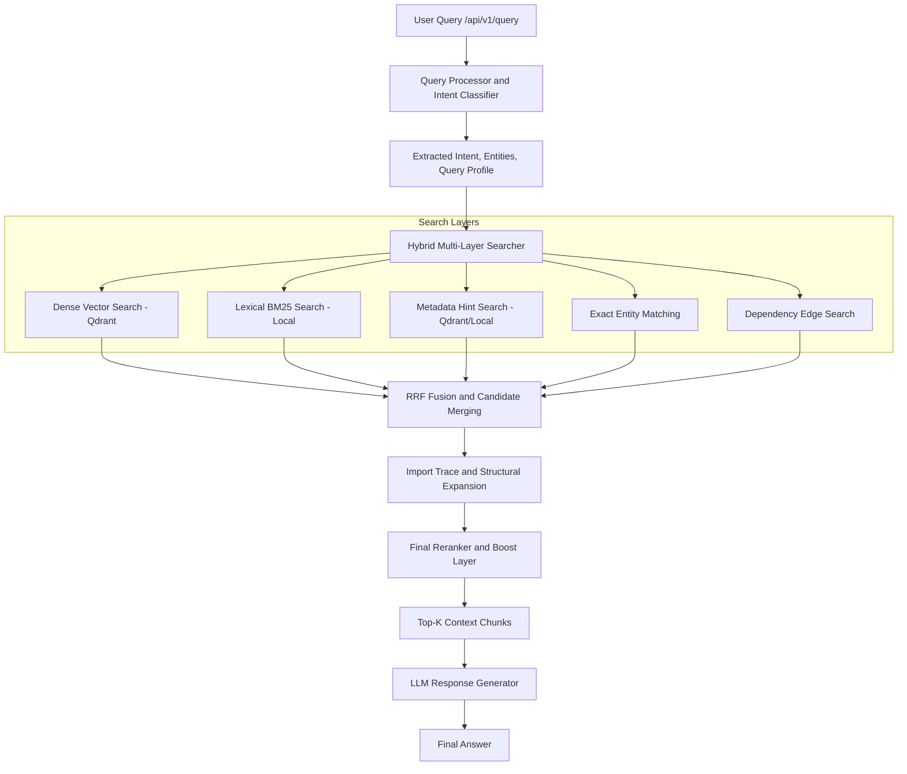

# CodeSeek Retrieval Pipeline Validation and Improvement Plan — V2.3

## 1. Purpose

This document defines the current CodeSeek retrieval pipeline, the validation strategy for proving retrieval correctness, and the planned improvements for making retrieval more accurate, observable, label-aware, operationally safe, and ready for future response-quality evaluation using RAGAS.

V2.3 updates the V2.2 retrieval plan with implementation-readiness fixes from the repo-aware audit:

- Runtime query classification must be deterministic-first and must not depend on a local LLM call by default.
- Exact entity hits must be protected across RRF and final reranking.
- Dependency no-edge fallback normalization is documented but config-gated.
- FOLLOWUP testing requires conversation-tree integration tests, not only static YAML.
- Milestone ordering now includes runtime classifier safety and conversation-state eval.

The retrieval system must account for these ingestion-provided fields:

```text
labels
code_intent
imports
calls
file_symbols
qualified_symbol
summary_facts
detected_frameworks
dependencies
env_keys
chunk_type
file_type
```

The core principle remains:

```text
Do not tune retrieval blindly.
First make every retrieval stage measurable.
Then refine one stage at a time.
Then add RAGAS after retrieval quality is stable.
```

---

## 2. Current Retrieval Pipeline

CodeSeek currently follows a multi-stage retrieval-augmented generation pipeline.



Current main stages:

```text
1. Query Processor and Intent Classifier
2. Hybrid Multi-Layer Search
3. RRF Fusion and Candidate Merging
4. Import Trace and Structural Expansion
5. Final Reranker and Boost Layer
6. Answer Generation
```

---

## 3. What Ingestion Now Delivers to Retrieval

Retrieval must be designed around the actual payload fields produced by ingestion.

### 3.1 Qdrant Payload Fields Now Available

Every chunk may carry these fields:

```text
labels
code_intent
imports
calls
file_symbols
qualified_symbol
summary_facts
detected_frameworks
dependencies
env_keys
chunk_type
file_type
```

Important clarification:

```text
label_confidences is not stored in the Qdrant payload.
It is ingestion-only transient metadata.
Retrieval must not depend on label_confidences at runtime.
```

### 3.2 Label Taxonomy From Ingestion Stage 13

The labeler produces labels from six categories:

```text
artifact:*
domain:*
capability:*
code_role:*
tech:*
question_use:*
```

Confidence tiers used during ingestion:

```text
STRONG = 0.90
MEDIUM = 0.70
WEAK = 0.55
```

Runtime retrieval does not consume these confidence values directly unless they are explicitly added to payload later.

For now, retrieval should assume:

```text
chunk.labels = list[str]
```

The most important label category for retrieval is:

```text
question_use:*
```

because it tells retrieval which type of user question a chunk is useful for.

Examples:

```text
question_use:code-snippet
question_use:implementation
question_use:technical-explanation
question_use:code-location
question_use:repo-overview
```

Other useful categories:

```text
domain:auth
domain:provider-management
capability:session-validation
capability:indexing
code_role:function
code_role:class
artifact:repo-summary
artifact:config
tech:fastapi
tech:qdrant
```

### 3.3 One-Time Re-Index Requirement for Label Introduction

When the label system is first introduced, a full re-index is required.

Required mode:

```text
recreate_collection = True
```

Reason:

```text
Existing Qdrant chunks from older index runs do not contain labels or code_intent.
Incremental indexing may skip unchanged files.
If unchanged files are skipped, they will not receive Stage 13 labels.
This can silently produce 0% or partial label coverage.
```

Required migration behavior:

```text
When deploying label-aware retrieval for the first time:
  1. Recreate the Qdrant collection.
  2. Re-index the full repository.
  3. Verify label coverage through index_health.py.
  4. Only then enable label-aware scoring in retrieval.
```

After the first full labeled re-index:

```text
Incremental indexing can work normally.
Modified files get re-labeled.
Unchanged files retain labels from the last full labeled index.
```

Failure condition:

```text
If label_coverage_percent < expected threshold:
  Do not tune label scoring.
  Do not enable label-aware reranking.
  Re-index first.
```

---

## 4. Phase 1: Query Processor and Intent Classifier

File:

```text
query_processor.py
```

The query processor is responsible for understanding the user question before retrieval begins.

It currently performs:

```text
- File path extraction
- Function/symbol extraction
- snake_case and camelCase token detection
- API route detection
- Environment variable detection
- Dependency/package keyword detection
- Architecture/overview marker detection
- Flow/lifecycle marker detection
- Intent classification
- Query profile construction
```

### 4.1 Canonical Runtime Intent Model

Previous versions of the retrieval doc mixed multiple intent systems:

```text
Legacy intents:
  SEMANTIC
  SYMBOL
  DEPENDENCY

Scored retrieval intents:
  OVERVIEW
  ARCHITECTURE
  CONFIG
  EXPLANATION
  SYMBOL
  FILE
  TRACE
  DEPENDENCY
  CODE_REQUEST
  FOLLOWUP
  LOW_CONTEXT
  SEMANTIC

Label classifier intents:
  code_snippet
  implementation
  technical_explanation
  code_location
  general_context
```

V2.3 clarifies that these are not the same thing.

CodeSeek should use two runtime layers:

```text
1. Label Classifier Intent
   Used to produce boost_labels for label-aware retrieval.

2. Reranker Intent
   Used to select intent-aware scoring weights.
```

The label classifier runs as a pre-pass before final reranking and produces:

```text
query_profile.label_intent
query_profile.reranker_intent
query_profile.boost_labels
query_profile.domain_hints
query_profile.capability_hints
query_profile.is_followup
query_profile.is_low_context
```

The reranker intent is a separate scoring layer applied after candidate retrieval and fusion.

### 4.2 Label Classifier Intent to Reranker Intent Mapping

Canonical mapping:

```text
Label Classifier Intent        Primary Reranker Intent
───────────────────────        ───────────────────────
code_snippet                   SYMBOL
implementation                 SYMBOL
technical_explanation          ARCHITECTURE
code_location                  FILE
general_context                OVERVIEW
```

Primary intent choices:

```text
implementation -> SYMBOL
  Because implementation/edit-target queries usually need function, method, or class chunks first.

code_location -> FILE
  Because location queries usually ask where something exists, so file/path ranking should dominate.

technical_explanation -> ARCHITECTURE
  Because explanation queries benefit from surrounding structural context.

general_context -> OVERVIEW
  Because broad repo questions should prefer repo_summary, README, and core orchestration chunks.
```

Additional runtime cases:

```text
FOLLOWUP
  Not a label classifier intent.
  Detected by conversation-memory/query-processor logic.
  Uses previous query context, previous retrieved files, and conversation memory.
  Reranker intent: FOLLOWUP.

LOW_CONTEXT
  Not a primary label classifier intent.
  Used when the query is too vague or underspecified.
  Should fall back to general_context behavior where possible.
  Reranker intent: LOW_CONTEXT or SEMANTIC fallback.
```

Examples:

```text
"Show me the session validation code"
  label intent: code_snippet
  reranker intent: SYMBOL
  boost labels:
    - question_use:code-snippet
    - domain:auth
    - capability:session-validation

"How do I change provider validation logic?"
  label intent: implementation
  reranker intent: SYMBOL
  boost labels:
    - question_use:implementation
    - domain:provider-management

"What does this repo do?"
  label intent: general_context
  reranker intent: OVERVIEW
  boost labels:
    - artifact:repo-summary
    - question_use:repo-overview

"How does auth work?"
  label intent: technical_explanation
  reranker intent: ARCHITECTURE
  boost labels:
    - domain:auth
    - question_use:technical-explanation

"What about this file?"
  runtime intent: FOLLOWUP
  reranker intent: FOLLOWUP
  behavior:
    - Use previous retrieval context.
    - Use previous mentioned files/symbols.
    - Do not rely only on label boost.

"Explain it"
  runtime intent: LOW_CONTEXT or FOLLOWUP depending on conversation state
  reranker intent:
    - FOLLOWUP if previous context exists
    - LOW_CONTEXT / SEMANTIC if no useful previous context exists
```

Important:

```text
FOLLOWUP and LOW_CONTEXT may fall back to DEFAULT_WEIGHTS if not explicitly implemented.
However, V2.3 recommends adding explicit weights and logging fallback behavior to avoid silent ranking changes.
```

### 4.3 Runtime Query Classification Safety

Runtime query classification must be deterministic-first.

Priority order:

```text
1. Regex/token/entity extraction
2. Keyword and phrase intent rules
3. Domain/capability hint extraction
4. Optional lightweight classifier
5. LLM fallback only when explicitly enabled
```

Default behavior:

```text
The default /api/v1/query path must not call a local LLM synchronously before retrieval.
```

Reason:

```text
A local LLM classifier in the hot path can introduce query latency, queue stalls, and failure modes unrelated to retrieval.
Retrieval must still work if the classifier LLM is unavailable.
```

Recommended config:

```python
ENABLE_LLM_QUERY_CLASSIFIER = False
QUERY_CLASSIFIER_MAX_TOKENS = 50
QUERY_CLASSIFIER_TIMEOUT_MS = 500
QUERY_CLASSIFIER_MODEL = "qwen-coder-classifier-fast"  # optional placeholder
```

If LLM query classification is enabled:

```text
- Use a small/fast classifier model.
- Limit output tokens to <= 50.
- Enforce a hard timeout.
- Fall back to deterministic classification on timeout or error.
- Log classifier latency and fallback reason.
```

Recommended trace fields:

```json
{
  "classifier_mode": "deterministic",
  "classifier_latency_ms": 12,
  "classifier_fallback_reason": null
}
```

### 4.4 Query Processor Validation Priority

The query processor must be validated before reranker tuning.

If intent or entities are wrong, retrieval can fail even if the search layers are individually healthy.

Examples:

```text
"Where is auth implemented?"
  Should behave like code_location / FILE.

"How is auth implemented?"
  Should behave like technical_explanation / ARCHITECTURE.

"Implement auth validation"
  Should behave like implementation / SYMBOL.

"What calls create_session?"
  Should behave like DEPENDENCY / TRACE at the reranker level.
```

Dependency trace note:

```text
Dependency trace queries such as "What calls X?", "What imports Y?",
and "Where is Z used?" do not have a dedicated label-classifier
intent in v1.

They map to code_location as the closest label-classifier intent,
while query_processor.py separately sets the reranker intent to DEPENDENCY.
```

Future improvement:

```text
Add a dedicated label classifier intent:

dependency_trace

Possible mapping:
dependency_trace -> DEPENDENCY
```

Do not add it until the label taxonomy and query classifier are ready for that expansion.

---

## 5. Phase 2: Hybrid Multi-Layer Search

File:

```text
searcher.py
```

CodeSeek uses multiple retrieval layers instead of relying only on vector search.

Current layers:

```text
1. Dense vector search
2. BM25 lexical search
3. Metadata hint search
4. Exact entity matching
5. Dependency edge search
```

---

## 6. Dense Vector Search

Dense retrieval encodes the query and searches the session-specific Qdrant collection.

### 6.1 Embedding Input

As of ingestion Stage 14, embeddings are no longer based only on raw code content.

Embedding input includes:

```text
File
Language
Type
Symbol
Qualified Symbol
Labels
Code Intent
Summary
Description
Code content
```

Example embedding-enriched text:

```text
File: backend/auth/session.py
Language: python
Type: function
Symbol: validate_session_token
Qualified Symbol: backend.auth.session.validate_session_token
Labels: domain:auth, capability:session-validation, question_use:code-snippet
Code Intent: Validates an auth session token and returns the active user session.
Summary: Session validation helper used by auth middleware.
Code:
...
```

### 6.2 Impact on Retrieval

This improves semantic recall.

Example query:

```text
show me session validation code
```

can now match chunks through:

```text
domain:auth
capability:session-validation
question_use:code-snippet
code_intent: Validates an auth session token...
```

instead of depending only on exact token overlap in code.

### 6.3 Strengths

```text
- Good for semantic questions
- Good for explanation queries
- Good for intent-specific queries
- Better after embedding labels and code_intent
```

### 6.4 Weaknesses

```text
- May still miss exact symbols
- May rank semantically similar but wrong chunks
- May be weak for very short queries
- Must be balanced with exact and metadata signals
```

---

## 7. BM25 Lexical Search

BM25 runs lexical matching over local code chunks.

### 7.1 Strengths

```text
- Good for exact words
- Good for function names
- Good for variable names
- Good for API paths
- Good for file names
- Good fallback when embeddings miss exact code tokens
```

### 7.2 Planned Tokenization Improvements

BM25 tokenization should split and preserve:

```text
snake_case
camelCase
PascalCase
kebab-case
file paths
API routes
environment variables
qualified symbols
```

Example:

```text
createRepoSession
```

should become:

```text
createRepoSession
create
repo
session
```

Example:

```text
create_repo_session
```

should become:

```text
create_repo_session
create
repo
session
```

Example:

```text
backend/retrieval/searcher.py
```

should become:

```text
backend/retrieval/searcher.py
backend
retrieval
searcher
py
```

---

## 8. Metadata Hint Search

Metadata hint search uses extracted entities from the query processor.

It can search Qdrant payload fields or fallback to direct repository file lookup.

### 8.1 Searchable Metadata Fields

Previously documented fields:

```text
relative_path
file_name
symbol_name
class_name
function_name
route
env_key
dependency
```

Now also available from ingestion:

```text
labels
code_intent
file_type
chunk_type
detected_frameworks
qualified_symbol
summary_facts
imports
calls
file_symbols
dependencies
env_keys
```

### 8.2 Runtime Use of New Fields

```text
labels
  Used for label-aware retrieval boost through compute_label_boost().
  Can also support filtering by question_use:* or domain:* for specific query types.

code_intent
  Not primarily a filter field.
  Used in embedding input and may be included in prompt context.
  Useful for debugging why a chunk matched semantically.

file_type
  Used for config and manifest queries.
  Examples:
    package_json
    dockerfile
    pyproject
    requirements_txt
    env_file

chunk_type
  Used for filtering code-snippet queries.
  Examples:
    function
    method
    class
    file
    repo_summary

detected_frameworks
  Used for technology/framework-specific retrieval.
  Examples:
    fastapi
    react
    qdrant
    sqlalchemy

qualified_symbol
  Used for exact symbol lookup without fragile string parsing.

imports / calls / file_symbols
  Used for dependency and trace-style queries.
```

### 8.3 Corrected Metadata Table

| Field | Source | Retrieval Use |
|---|---|---|
| `relative_path` | Chunker / ingestion | File lookup, path boost, stale file validation |
| `symbol_name` | AST chunker | Symbol/function/class lookup |
| `qualified_symbol` | Stage 9 | Exact symbol lookup across files/modules |
| `labels` | Labeler Stage 13 | Label-aware retrieval boost via `compute_label_boost()` |
| `code_intent` | Labeler Stage 13 | Included in embedding input and LLM prompt context; not a primary filter field |
| `chunk_type` | Chunker Stage 7 | Filter code-snippet queries to function/method/class/file/repo_summary |
| `file_type` | Summary Stage 10 | Config and manifest retrieval; distinguishes Dockerfile/package_json/pyproject |
| `imports` | AST Stage 7 | Import-trace expansion |
| `calls` | AST Stage 7 | Dependency and caller/callee lookup |
| `file_symbols` | AST Stage 7 | File-level symbol discovery |
| `summary_facts` | Summary Stage 10 | Architecture and overview support |
| `detected_frameworks` | Summary Stage 10 | Framework-aware retrieval |
| `dependencies` | Summary Stage 10 | Dependency/package questions |
| `env_keys` | Summary Stage 10 | Environment/config lookup |

Important correction:

```text
class_definition is not a valid Stage 13 label.
Use code_role:class instead.
```

---

## 9. Exact Entity Matching

Exact entity matching compares extracted query entities with indexed payload fields or chunk text.

Common entities:

```text
API routes
environment variables
dependency names
function names
class names
file names
configuration keys
qualified symbols
framework names
```

### 9.1 Strengths

```text
- Strong for precise technical lookup
- Strong for route/env/symbol questions
- Useful when semantic search is too broad
```

### 9.2 Planned Improvements

```text
- Normalize qualified symbols
- Normalize framework names
- Normalize env keys
- Match file name and full relative path
- Match exact symbol and split symbol parts
- Prefer exact matches over semantic-only results for code-location queries
```

---

## 10. Dependency Edge Search

Dependency edge search is used when the query asks about relationships.

Example queries:

```text
"What calls create_repo_session?"
"Where is index_repository used?"
"Which files depend on searcher.py?"
"What imports db.py?"
```

This layer should use:

```text
imports
calls
file_symbols
qualified_symbol
dependencies
```

### 10.1 Strengths

```text
- Important for trace/debug questions
- Helps answer caller/callee relationships
- Helps implementation-impact analysis
```

### 10.2 Weaknesses

```text
- Depends on complete AST metadata
- May require language-specific parsing
- Can fail if calls/imports are incomplete
```

---

## 11. RRF Fusion and Candidate Merging

After individual retrieval layers return candidates, CodeSeek merges them using Reciprocal Rank Fusion.

Formula:

```text
fusion_score = sum(1 / (60 + rank_in_layer))
```

The goal is to reward chunks that appear high across multiple retrieval layers.

Additional logic:

```text
- Mark candidates that appear in multiple layers as multi_layer_hit
- Preserve source layer information
- Prioritize exact retrieval hits
- Merge duplicate candidates
- Sort candidates before expansion/reranking
```

### 11.1 Required Candidate Debug Metadata

Every merged candidate should preserve:

```text
chunk_id
relative_path
symbol_name
qualified_symbol
chunk_type
file_type
labels
source_layers
dense_rank
bm25_rank
metadata_rank
exact_rank
dependency_rank
fusion_score
multi_layer_hit
exact_hit
exact_hit_type
exact_hit_value
protected_exact_hit
```

This metadata is necessary for debugging failed retrieval cases.

### 11.2 Exact-Hit Protection Rule

Exact entity hits for critical identifiers must not be buried by RRF.

Critical identifiers:

```text
- exact API routes
- exact environment variables
- exact file paths
- exact qualified symbols
- exact function/class names when query intent is FILE or SYMBOL
```

If a candidate is an exact critical hit:

```text
- preserve exact_hit = true
- preserve exact_hit_type
- preserve exact_hit_value
- set protected_exact_hit = true for critical identifiers
- apply protected ranking before or during final rerank
```

Suggested candidate fields:

```json
{
  "exact_hit": true,
  "exact_hit_type": "qualified_symbol",
  "exact_hit_value": "backend.auth.session.validate_session_token",
  "protected_exact_hit": true
}
```

Protected-hit behavior:

```text
For FILE/SYMBOL/CONFIG queries, protected exact hits should not fall below non-exact semantic-only hits unless there is a strong safety reason or deduplication conflict.
```

Validation implication:

```text
If exact layer rank 1 is a protected exact hit and final rank is below top-k, report an exact_hit_regression.
```

---

## 12. Import Trace and Structural Expansion

After retrieval and fusion, CodeSeek expands context.

Expansion types:

```text
supporting_import
architecture_injection
overview_injection
readme_injection
core_module_injection
repo_summary_injection
```

### 12.1 Import Trace Expansion

The system inspects imports from top candidates and resolves related files.

Example:

```javascript
import { createSession } from "./session";
```

The pipeline may retrieve `session.js` as supporting context.

### 12.2 Structural Expansion

For architecture or overview queries, the system may inject:

```text
README files
repository summaries
core orchestration modules
main application entry files
configuration files
repo_summary chunks
```

### 12.3 Expansion Rules for V2.3

```text
max_import_expansion_depth = 1
max_expansion_chunks = 3 to 5
supporting_import cannot outrank a primary exact hit
deduplicate by chunk_id
prefer same-directory imports
avoid generated/vendor/build files
avoid expansion for exact file lookup unless needed
```

---

## 13. Final Reranker and Boost Layer

The final reranker computes a combined score.

### 13.1 Current Fixed Formula

Current formula:

```text
final_score =
  0.70 * vector_score
+ 0.15 * exact_match_score
+ 0.10 * label_boost
+ 0.05 * path_symbol_boost
```

All component scores must be normalized:

```text
vector_score:       [0.0, 1.0]
exact_match_score:  [0.0, 1.0]
label_boost:        [0.0, 1.0]
path_symbol_boost:  [0.0, 1.0]
dependency_score:   [0.0, 1.0]
```

### 13.2 Label Boost Computation

File:

```text
backend/retrieval/label_scoring.py
```

Functions:

```text
compute_label_boost(chunk_labels, query_profile) -> float
parse_label_category(label) -> str
normalize_boost_labels(labels) -> list[str]
```

`label_boost` comes from ingestion labels stored in the Qdrant payload.

Source:

```text
chunk.labels from Qdrant payload
```

Query side:

```text
classify_query_intent(query) -> query_profile
query_profile.boost_labels -> list[str]
```

Runtime function:

```text
compute_label_boost(chunk_labels, query_profile) -> float in [0.0, 1.0]
```

Label category weights:

```python
LABEL_WEIGHTS = {
    "question_use": 0.15,
    "capability":   0.12,
    "domain":       0.10,
    "artifact":     0.08,
    "code_role":    0.08,
    "tech":         0.06,
}
```

Implementation sketch:

```python
def parse_label_category(label: str) -> str:
    if ":" not in label:
        return ""
    return label.split(":", 1)[0]


def compute_label_boost(chunk_labels: list[str], query_profile) -> float:
    if not chunk_labels:
        return 0.0

    boost_labels = set(getattr(query_profile, "boost_labels", []) or [])
    if not boost_labels:
        return 0.0

    score = 0.0

    for label in chunk_labels:
        if label not in boost_labels:
            continue

        category = parse_label_category(label)
        score += LABEL_WEIGHTS.get(category, 0.0)

    return min(score, 1.0)
```

Maximum contribution under the current fixed formula:

```text
0.10 * 1.0 = 0.10
```

Fallback behavior:

```text
If a chunk has no labels:
  label_boost = 0.0

If query intent classifier is not wired yet:
  label_boost = 0.0

If query_profile.boost_labels is empty:
  label_boost = 0.0
```

Important implementation rule:

```text
label_boost must be normalized to [0.0, 1.0].
Do not return a tiny pre-weighted value like 0.03 and then multiply it again.
The outer reranker weight applies the final contribution.
```

### 13.3 Intent-Aware Reranking

The fixed formula should eventually be replaced by intent-aware weights.

The base terms are:

```text
vector_score
exact_match_score
label_boost
path_symbol_boost
dependency_score, only for DEPENDENCY intent
```

Default fixed formula:

```text
final_score =
  0.70 * vector_score
+ 0.15 * exact_match_score
+ 0.10 * label_boost
+ 0.05 * path_symbol_boost
```

Intent-aware weights:

```python
DEFAULT_WEIGHTS = {
    "vector":       0.70,
    "exact":        0.15,
    "label":        0.10,
    "path_symbol":  0.05,
}

WEIGHTS_BY_INTENT = {
    "FILE": {
        "vector":       0.25,
        "exact":        0.35,
        "label":        0.10,
        "path_symbol":  0.30,
    },
    "SYMBOL": {
        "vector":       0.30,
        "exact":        0.30,
        "label":        0.15,
        "path_symbol":  0.25,
    },
    "ARCHITECTURE": {
        "vector":       0.45,
        "exact":        0.05,
        "label":        0.30,
        "path_symbol":  0.20,
    },
    "OVERVIEW": {
        "vector":       0.40,
        "exact":        0.05,
        "label":        0.35,
        "path_symbol":  0.20,
    },
    "DEPENDENCY": {
        "vector":       0.20,
        "exact":        0.20,
        "label":        0.15,
        "path_symbol":  0.10,
        "dependency":   0.35,
    },
    "CONFIG": {
        "vector":       0.25,
        "exact":        0.30,
        "label":        0.20,
        "path_symbol":  0.25,
    },
    "SEMANTIC": {
        "vector":       0.55,
        "exact":        0.10,
        "label":        0.25,
        "path_symbol":  0.10,
    },
    "FOLLOWUP": {
        "vector":       0.50,
        "exact":        0.10,
        "label":        0.15,
        "path_symbol":  0.25,
    },
    "LOW_CONTEXT": {
        "vector":       0.55,
        "exact":        0.05,
        "label":        0.20,
        "path_symbol":  0.20,
    },
}
```

Application:

```python
w = WEIGHTS_BY_INTENT.get(intent, DEFAULT_WEIGHTS)

final_score = (
    w["vector"] * vector_score
    + w["exact"] * exact_match_score
    + w["label"] * label_boost
    + w["path_symbol"] * path_symbol_boost
)

if intent == "DEPENDENCY":
    final_score += w["dependency"] * dependency_score
```

Important distinction:

```text
compute_label_boost() computes the value of label_boost.
WEIGHTS_BY_INTENT decides how much label_boost matters for the current reranker intent.
```

Weight validation rule:

```text
For non-DEPENDENCY intents:
  vector + exact + label + path_symbol must sum to 1.0.

For DEPENDENCY:
  vector + exact + label + path_symbol + dependency must sum to 1.0.
```

### 13.3.1 DEPENDENCY No-Edge Scoring Behavior

For `DEPENDENCY` intent, the base weights sum to:

```text
vector + exact + label + path_symbol
= 0.20 + 0.20 + 0.15 + 0.10
= 0.65
```

The dependency evidence contributes:

```text
dependency = 0.35
```

If `dependency_score = 0.0` because no dependency edges were found, then the final score only uses 65% of the possible score range.

This is intentional by default in V2.3.

Reason:

```text
A dependency query with no call/import/dependency-edge evidence should rank lower than a dependency result where actual dependency evidence was found.
```

### 13.3.2 Optional DEPENDENCY Fallback Normalization

If baseline evaluations show too many useful dependency fallback results are being buried, enable config-gated fallback normalization.

Recommended config:

```python
ENABLE_DEPENDENCY_FALLBACK_NORMALIZATION = False
```

Optional behavior:

```python
if intent == "DEPENDENCY":
    base_score = (
        w["vector"] * vector_score
        + w["exact"] * exact_match_score
        + w["label"] * label_boost
        + w["path_symbol"] * path_symbol_boost
    )

    if dependency_score > 0:
        final_score = base_score + w["dependency"] * dependency_score
    elif ENABLE_DEPENDENCY_FALLBACK_NORMALIZATION:
        final_score = base_score / 0.65
    else:
        final_score = base_score
```

Rules:

```text
- Do not enable fallback normalization before baseline evaluation.
- Log when fallback normalization is applied.
- Compare dependency query file_hit@5 and wrong_top1_rate before and after enabling it.
```

Trace field:

```json
{
  "dependency_fallback_normalized": false
}
```

---

## 14. Answer Generation

Files:

```text
code_answers.py
llm.py
follow_up_memory.py
```

The final top-k context is assembled into a structured prompt.

The prompt may include:

```text
- Retrieved source chunks
- File metadata
- Line ranges
- Labels
- code_intent
- chunk_type
- file_type
- qualified_symbol
- Conversation history
- Detected intent
- Answer mode
```

### 14.1 Answer Generation Risk

If retrieval provides poor context, the LLM may hallucinate.

Therefore:

```text
Retrieval validation must happen before RAGAS response-quality evaluation.
```

RAGAS should evaluate final answer quality later, but CodeSeek must first prove that the retrieved context is correct.

---

## 15. Main Validation Goal

The primary retrieval validation question is:

```text
Did CodeSeek retrieve the correct context for the user query?
```

Not:

```text
Did the LLM produce a polished answer?
```

Validation should answer:

```text
- Is the repo index healthy?
- Is the query intent correct?
- Were entities extracted correctly?
- Did labels exist in payload?
- Did each search layer find the expected result?
- Did exact critical hits survive RRF and reranking?
- Did label boost improve or at least not hurt results?
- Did RRF improve or damage ranking?
- Did reranking improve or damage ranking?
- Did expansion add useful context or noise?
- Did final top-k contain the required files/symbols/labels?
```

---

## 16. Validation Strategy

Recommended validation order:

```text
1. Index health validation
2. Golden query dataset
3. Conversation-tree integration dataset
4. Query processor validation
5. Runtime classifier safety validation
6. Individual retrieval layer validation
7. RRF and exact-hit protection validation
8. Reranker validation
9. Label boost validation
10. Expansion validation
11. End-to-end retrieval validation
12. Answer trace logging
13. RAGAS response quality evaluation
```

---

## 17. Phase 1: Index Health Validation

Before testing search quality, validate that the indexed data is correct.

### 17.1 Required Checks

```text
- Active session points to the correct repository
- Qdrant collection exists
- Qdrant point count is greater than zero
- Collection belongs to the active session
- Each point has chunk_id
- Each point has relative_path
- Each point has content or reconstructable content
- Each point has start_line and end_line
- Each point has chunk_type
- Each point has file_type where applicable
- Symbol chunks have symbol_name where applicable
- Symbol chunks have qualified_symbol where applicable
- Chunks have labels if label system is enabled
- Chunks have code_intent if label system is enabled
- Indexed file paths exist in the current repo
- Deleted files do not remain in Qdrant
- Repo freshness status is known
- Current repo commit/hash is stored
```

### 17.2 Label Coverage Audit

If label-aware retrieval is enabled, validate:

```text
label_coverage_percent
code_intent_coverage_percent
question_use_label_coverage_percent
domain_label_coverage_percent
chunk_type_coverage_percent
qualified_symbol_coverage_percent
```

Expected:

```text
label_coverage_percent = 100% for eligible chunks
code_intent_coverage_percent = 100% for eligible chunks
```

If coverage is low:

```text
Do not tune label scoring.
Fix ingestion or re-index first.
```

### 17.3 Example Output

```text
INDEX HEALTH REPORT

session_id: abc123
repo_root: /home/user/projects/CodeSeek
collection: codeseek_abc123
points_count: 2142

missing_chunk_id: 0
missing_relative_path: 0
missing_line_range: 0
missing_content: 0
missing_chunk_type: 0
missing_file_type: 8
missing_labels: 0
missing_code_intent: 0
missing_qualified_symbol: 14
stale_file_paths: 0
deleted_file_chunks: 0
content_reconstruction_failures: 0

label_coverage_percent: 100.0
code_intent_coverage_percent: 100.0

repo_freshness_status: current
current_commit: 9f31abc
indexed_commit: 9f31abc

VERDICT: PASS
```

### 17.4 One-Time Re-Index Requirement for Label System Introduction

When the label system is first introduced, a full re-index is required.

Required mode:

```text
recreate_collection = True
```

Reason:

```text
Existing Qdrant chunks from older index runs do not contain labels or code_intent.
Incremental indexing may skip unchanged files.
If unchanged files are skipped, they will not receive Stage 13 labels.
This can silently produce 0% or partial label coverage.
```

Required migration behavior:

```text
When deploying label-aware retrieval for the first time:
  1. Recreate the Qdrant collection.
  2. Re-index the full repository.
  3. Verify label coverage through index_health.py.
  4. Only then enable label-aware scoring in retrieval.
```

After the first full labeled re-index:

```text
Incremental indexing can work normally.
Modified files get re-labeled.
Unchanged files retain labels from the last full labeled index.
```

Failure condition:

```text
If label_coverage_percent < expected threshold:
  Do not tune label scoring.
  Do not enable label-aware reranking.
  Re-index first.
```

---

## 18. Phase 2: Golden Query Dataset

Create a manually labeled dataset.

Recommended file:

```text
evals/golden_queries.yaml
```

Start with 30 to 50 queries.

### 18.1 Golden Query Schema

Each query should contain:

```text
id
query
category
expected_intent
expected_reranker_intent
expected_files
expected_file_types
expected_symbols
expected_context_ids
expected_labels_in_top1
expected_labels_in_top3
expected_labels_in_top5
must_hit_top_k
notes
```

### 18.2 Standard Examples

```yaml
- id: q001
  query: "Where is repo session creation handled?"
  category: "code_location"
  expected_intent: "code_location"
  expected_reranker_intent: "FILE"
  expected_files:
    - "backend/db.py"
    - "backend/api.py"
  expected_symbols:
    - "create_repo_session"
  must_hit_top_k: 5

- id: q002
  query: "How does the retrieval pipeline work?"
  category: "architecture"
  expected_intent: "technical_explanation"
  expected_reranker_intent: "ARCHITECTURE"
  expected_files:
    - "backend/retrieval/query_processor.py"
    - "backend/retrieval/searcher.py"
    - "backend/retrieval/code_answers.py"
  must_hit_top_k: 10

- id: q003
  query: "What calls index_repository?"
  category: "dependency_trace"
  expected_intent: "code_location"   # closest label-classifier match in v1
  expected_reranker_intent: "DEPENDENCY"
  expected_symbols:
    - "index_repository"
  must_hit_top_k: 5
  notes: >
    Dependency trace queries such as "What calls X?", "What imports Y?",
    and "Where is Z used?" do not have a dedicated label-classifier
    intent in v1. They map to code_location as the closest label
    classifier intent, while query_processor.py separately sets the
    reranker intent to DEPENDENCY.

- id: q004
  query: "Show me where Qdrant upsert happens"
  category: "symbol_lookup"
  expected_intent: "code_location"
  expected_reranker_intent: "FILE"
  expected_files:
    - "backend/rag_ingestion/stages/storage.py"
  expected_symbols:
    - "upsert"
  must_hit_top_k: 5
```

Future improvement:

```text
Consider adding a dedicated label classifier intent:

dependency_trace

Possible mapping:
dependency_trace -> DEPENDENCY
```

Do not add it until the label taxonomy and query classifier are ready for that expansion.

### 18.3 Label-Specific Retrieval Validation Examples

```yaml
- id: q041
  query: "Show me the session validation code"
  category: "code_snippet"
  expected_intent: "code_snippet"
  expected_reranker_intent: "SYMBOL"
  expected_labels_in_top3:
    - "question_use:code-snippet"
    - "domain:auth"
    - "capability:session-validation"
  must_hit_top_k: 3

- id: q042
  query: "How do I change the provider validation logic?"
  category: "implementation"
  expected_intent: "implementation"
  expected_reranker_intent: "SYMBOL"
  expected_labels_in_top3:
    - "question_use:implementation"
    - "domain:provider-management"
  must_hit_top_k: 5

- id: q043
  query: "What does this repo do?"
  category: "general_context"
  expected_intent: "general_context"
  expected_reranker_intent: "OVERVIEW"
  expected_labels_in_top1:
    - "artifact:repo-summary"
    - "question_use:repo-overview"
  must_hit_top_k: 1

- id: q044
  query: "How does auth work?"
  category: "technical_explanation"
  expected_intent: "technical_explanation"
  expected_reranker_intent: "ARCHITECTURE"
  expected_labels_in_top5:
    - "domain:auth"
    - "question_use:technical-explanation"
  must_hit_top_k: 5
```

### 18.4 CONFIG Golden Query Example

```yaml
- id: q045
  query: "What environment variables does this project use?"
  category: "config"
  expected_intent: "general_context"
  expected_reranker_intent: "CONFIG"
  expected_file_types:
    - "env_file"
  expected_labels_in_top3:
    - "artifact:config"
    - "question_use:config-question"
  must_hit_top_k: 3
  notes: >
    This validates config/manifest retrieval using file_type, env_keys,
    artifact labels, and config-question labels. Expected labels must
    match the actual Stage 13 taxonomy. Do not invent labels in evals
    unless the labeler emits them.
```

If the repository has a known config file, add it explicitly:

```yaml
expected_files:
  - ".env.example"
```

Only include `.env.example` if it actually exists in the repo.

### 18.5 FOLLOWUP Conversation-Tree Test Strategy

FOLLOWUP queries require conversation state and cannot be fully tested with static golden queries.

Recommended file:

```text
evals/conversation_trees.yaml
```

They must be tested through integration tests that seed:

```text
- previous user query
- previous retrieved files
- previous retrieved symbols
- previous answer mode
- mock DB session context
- follow_up_memory.py state
```

Example integration scenario:

```yaml
- id: conv_001
  title: "Follow-up file explanation"
  steps:
    - id: followup_001_step_1
      query: "Where is session validation implemented?"
      expected_intent: "code_location"
      expected_reranker_intent: "FILE"
      expected_labels_in_top5:
        - "domain:auth"

    - id: followup_001_step_2
      query: "Explain this file"
      category: "followup"
      expected_reranker_intent: "FOLLOWUP"
      requires_conversation_state: true
      expected_uses_previous_files: true
```

Static eval can validate the first step. Integration eval must validate the follow-up step.

---

## 19. Phase 3: Query Processor Validation

The query processor should be validated independently before retrieval.

### 19.1 Inputs

```text
golden query
expected intent
expected reranker intent
expected files
expected symbols
expected routes
expected env keys
expected dependencies
expected labels
```

### 19.2 Outputs

```text
actual label classifier intent
actual reranker intent
is_followup
is_low_context
classifier_mode
classifier_latency_ms
classifier_fallback_reason
extracted files
extracted symbols
extracted routes
extracted env keys
extracted dependencies
domain hints
capability hints
boost_labels
```

Required query intent functions:

```text
classify_query_intent(query)
extract_domain_hints(query)
extract_capability_hints(query)
map_label_intent_to_reranker_intent(label_intent, is_followup=False, is_low_context=False)
identify_followup_or_low_context(query, conversation_state)
```

Implementation location:

```text
backend/retrieval/query_intent.py
```

If `extract_capability_hints()` is not implemented in the first pass, remove it from both the module responsibility list and this validation section. Do not document it in only one place.

### 19.3 Metrics

```text
intent_accuracy
reranker_intent_accuracy
file_extraction_accuracy
symbol_extraction_accuracy
route_extraction_accuracy
env_key_extraction_accuracy
dependency_extraction_accuracy
boost_label_accuracy
followup_detection_accuracy
low_context_detection_accuracy
classifier_latency_p95
classifier_fallback_rate
```

### 19.4 Example Report

```text
QUERY PROCESSOR REPORT

Query:
"Show me the session validation code"

Expected intent:
code_snippet

Actual intent:
code_snippet

Expected boost labels:
["question_use:code-snippet", "domain:auth", "capability:session-validation"]

Actual boost labels:
["question_use:code-snippet", "domain:auth", "capability:session-validation"]

is_followup:
false

is_low_context:
false

classifier_mode:
deterministic

classifier_latency_ms:
12

Verdict:
PASS
```

---

## 20. Phase 4: Individual Retrieval Layer Validation

Each retrieval layer should be tested separately.

For every golden query, capture:

```text
dense_top_5
bm25_top_5
metadata_top_5
exact_top_5
dependency_top_5
```

### 20.1 Metrics

Per-layer validation should focus on whether each search layer finds the expected file or symbol.

```text
dense_file_hit@5
bm25_file_hit@5
metadata_file_hit@5
exact_file_hit@5
dependency_file_hit@5

dense_symbol_hit@5
bm25_symbol_hit@5
metadata_symbol_hit@5
exact_symbol_hit@5
dependency_symbol_hit@5
```

Do not include these as Phase 4 metrics:

```text
dense_label_hit@5
metadata_label_hit@5
```

Reason:

```text
Labels are attached to chunks, but label boost is not a standalone retrieval layer.
Label quality is only meaningful after reranking when label_boost has affected final order.
Therefore label validation belongs in Phase 7: Label Boost Validation.
```

### 20.2 Example Report

```text
Query:
"Show me where Qdrant upsert happens"

Expected file:
backend/rag_ingestion/stages/storage.py

Dense top 5:
FAIL

BM25 top 5:
PASS

Metadata top 5:
PASS

Exact top 5:
PASS

Dependency top 5:
N/A

Conclusion:
Dense is weak for this exact symbol query, but lexical and metadata retrieval are healthy.
```

---

## 21. Phase 5: RRF Fusion and Exact-Hit Protection Validation

RRF should preserve good results from individual layers.

### 21.1 Required Checks

```text
- Correct candidate found by any layer should not disappear after fusion
- Multi-layer hits should be ranked higher
- Exact metadata matches should not be buried
- Protected exact hits should remain in top-k
- Duplicate chunks should be merged
- Candidate source layers should be preserved for debugging
```

### 21.2 Metrics

```text
rrf_file_hit@5
rrf_symbol_hit@5
best_layer_rank
rrf_rank
rank_delta_after_rrf
multi_layer_hit_rate
duplicate_candidate_rate
protected_exact_hit_preserved@5
exact_hit_regression_count
```

Do not include this as an RRF metric:

```text
rrf_label_hit@5
```

Reason:

```text
Label boost is not applied until the final reranker.
RRF only merges retrieval-layer candidates.
Label quality is evaluated in Phase 7 after reranking through label_hit@k and label_boost_delta_* metrics.
```

### 21.3 Example Failure

```text
BM25 rank: 1
Metadata rank: 1
Dense rank: not found
RRF rank: 8

Verdict:
RRF is damaging exact-match retrieval.
```

### 21.4 Exact-Hit Regression Example

```text
Query:
"Where is /api/v1/query implemented?"

Exact layer:
rank 1 -> backend/routes/query.py, exact_hit_type=api_route

Final RRF:
rank 12

Verdict:
exact_hit_regression
```

---

## 22. Phase 6: Final Reranker Validation

The final reranker should improve ranking, not bury correct results.

### 22.1 Required Checks

```text
- Correct file remains in top-k after reranking
- Exact file/symbol matches are boosted enough
- Protected exact hits are preserved
- Label boost is applied correctly
- Architecture queries get structural chunks
- Dependency queries prioritize caller/callee relationships
- Supporting import chunks do not outrank primary hits
```

### 22.2 Metrics

```text
final_file_hit@1
final_file_hit@3
final_file_hit@5
final_symbol_hit@5
final_label_hit@5
protected_exact_hit_preserved@5
exact_hit_regression_count
wrong_top1_rate
rank_delta_after_rerank
reranker_regression_count
```

### 22.3 Example Failure

```text
Query:
"Where is create_repo_session implemented?"

Best layer rank:
1

RRF rank:
2

Final rerank:
9

Verdict:
Reranker regression.
```

---

## 23. Phase 7: Label Boost Validation

Label boost must be tested as its own measurable effect.

It is not a separate retrieval source like BM25 or dense search. It is a scoring influence inside the reranker. Still, it must be validated explicitly.

### 23.1 Validation Method

For each golden query with `expected_labels_in_top_k`:

```text
1. Retrieve final top-k with label weight disabled.
2. Retrieve final top-k with label boost active.
3. Compare file_hit@k, symbol_hit@k, label_hit@k, and wrong_top1_rate.
```

### 23.2 Metrics

```text
label_boost_delta_file_hit@5
label_boost_delta_symbol_hit@5
label_boost_delta_label_hit@5
label_boost_wrong_top1_delta
label_boost_rank_delta
```

Definitions:

```text
label_boost_delta_file_hit@5 =
  file_hit@5 with labels - file_hit@5 without labels

label_boost_delta_symbol_hit@5 =
  symbol_hit@5 with labels - symbol_hit@5 without labels

label_boost_wrong_top1_delta =
  wrong_top1_rate with labels - wrong_top1_rate without labels
```

### 23.3 Success Criteria

```text
label_boost_delta_file_hit@5 >= 0
label_boost_delta_symbol_hit@5 >= 0
label_boost_wrong_top1_delta <= 0
No regression on existing file_hit@5 baseline
```

Interpretation:

```text
Labels do not need to improve every query immediately.
But labels must not make retrieval worse.
```

---

## 24. Phase 8: Expansion Validation

Expansion should add useful context without damaging primary retrieval.

### 24.1 Required Checks

```text
- supporting_import chunks are marked clearly
- expansion chunks are capped
- duplicate chunks are removed
- primary hits remain above supporting hits
- exact symbol queries are not over-expanded
- architecture queries receive structural context
```

### 24.2 Metrics

```text
expansion_added_count
useful_expansion_rate
duplicate_after_expansion_rate
primary_hit_preserved
expansion_noise_rate
```

---

## 25. End-to-End Retrieval Validation

After individual phases are validated, run full retrieval without answer generation.

Input:

```text
query
session_id
golden expectations
```

Output:

```text
intent
reranker intent
is_followup
is_low_context
classifier_mode
classifier_latency_ms
entities
boost labels
layer results
RRF results
expanded results
final top-k
PASS/FAIL
```

### 25.1 Main Metrics

```text
intent_accuracy
reranker_intent_accuracy
boost_label_accuracy
followup_detection_accuracy
low_context_detection_accuracy
classifier_latency_p95
classifier_fallback_rate

file_hit@1
file_hit@3
file_hit@5
symbol_hit@5
label_hit@5
chunk_hit@5
protected_exact_hit_preserved@5
exact_hit_regression_count

wrong_top1_rate
empty_result_rate
duplicate_context_rate
reranker_regression_count

label_boost_delta_file_hit@5
label_boost_delta_symbol_hit@5
label_boost_wrong_top1_delta
```

### 25.2 Example CLI

```bash
python -m backend.evals.retrieval_eval \
  --session-id <session_id> \
  --golden evals/golden_queries.yaml \
  --output evals/reports/latest.json
```

Conversation-tree eval:

```bash
python -m backend.evals.conversation_eval \
  --session-id <session_id> \
  --trees evals/conversation_trees.yaml \
  --output evals/reports/conversation_latest.json
```

### 25.3 Example Output

```text
RETRIEVAL EVAL REPORT

Total queries: 45

intent_accuracy: 88.6%
reranker_intent_accuracy: 86.3%
boost_label_accuracy: 81.8%
followup_detection_accuracy: integration-only
low_context_detection_accuracy: 90.0%
classifier_latency_p95: 18ms
classifier_fallback_rate: 0.0%

file_hit@1: 63.6%
file_hit@3: 77.2%
file_hit@5: 88.6%
symbol_hit@5: 81.8%
label_hit@5: 84.0%
protected_exact_hit_preserved@5: 97.5%
exact_hit_regression_count: 1

wrong_top1_rate: 20.4%
empty_result_rate: 0.0%
duplicate_context_rate: 3.7%

label_boost_delta_file_hit@5: +2.3%
label_boost_delta_symbol_hit@5: +1.1%
label_boost_wrong_top1_delta: -4.5%

Failed queries:
- q007: expected storage.py, final rank 9
- q013: intent expected DEPENDENCY, got SEMANTIC
- q021: correct file found by BM25 but buried after rerank
- q044: expected domain:auth in top5, not found
- q046: protected exact route hit fell to rank 8
```

Note:

```text
Per-layer label metrics are intentionally not shown.
label_hit@5 is evaluated after final reranking.
label_boost_delta_* metrics compare final retrieval with label boost disabled vs enabled.
FOLLOWUP queries require integration tests with conversation state.
```

---

## 26. Proposed Evaluation Module Structure

Recommended structure:

```text
backend/
  evals/
    __init__.py
    golden_loader.py
    index_health.py
    query_processor_eval.py
    retrieval_eval.py
    conversation_eval.py
    metrics.py
    trace_writer.py
    report_writer.py
    ragas_adapter.py

backend/
  retrieval/
    query_intent.py
    label_scoring.py
```

### 26.1 File Responsibilities

#### `golden_loader.py`

```text
- Parse YAML
- Validate required fields
- Normalize expected paths
- Validate query IDs are unique
- Validate expected label fields
- Validate expected_file_types if present
```

#### `index_health.py`

```text
- Check Qdrant collection
- Count indexed points
- Validate payload fields
- Detect stale file paths
- Compare indexed commit with current repo commit
- Audit label/code_intent coverage
```

#### `query_processor_eval.py`

```text
- Run query processor only
- Compare expected vs actual label classifier intent
- Compare expected vs actual reranker intent
- Compare expected vs extracted entities
- Compare expected boost_labels
- Validate is_followup and is_low_context where testable
- Track classifier latency and fallback mode
```

#### `retrieval_eval.py`

```text
- Run each retrieval layer
- Capture per-layer top-k
- Run fusion
- Run expansion
- Run reranker
- Compute deterministic metrics
- Run label boost delta validation
- Save report
```

#### `conversation_eval.py`

```text
- Load evals/conversation_trees.yaml
- Seed mock conversation state
- Seed previous retrieved files/symbols
- Run multi-step retrieval flows
- Validate FOLLOWUP behavior
- Save conversation eval report
```

#### `metrics.py`

```text
- file_hit@k
- symbol_hit@k
- label_hit@k
- label_coverage@k, optional softer diagnostic metric
- chunk_hit@k
- protected_exact_hit_preserved@k
- exact_hit_regression_count
- intent accuracy
- boost label accuracy
- duplicate context rate
- empty result rate
- wrong top-1 rate
- reranker regression count
- label boost deltas
- classifier latency metrics
```

#### `trace_writer.py`

```text
- Save JSON trace per query
- Include query, intent, entities, boost_labels, followup flags, classifier mode, contexts, scores, model info, config hash
```

#### `query_intent.py`

Responsibilities:

```text
- classify_query_intent(query)
- extract_domain_hints(query)
- extract_capability_hints(query)
- map_label_intent_to_reranker_intent(label_intent, is_followup=False, is_low_context=False)
- identify_followup_or_low_context(query, conversation_state)
- optional_llm_classify_query(query), config-gated only
```

Return object:

```python
from dataclasses import dataclass

@dataclass
class QueryProfile:
    label_intent: str
    reranker_intent: str
    boost_labels: list[str]
    domain_hints: list[str]
    capability_hints: list[str]
    is_followup: bool = False
    is_low_context: bool = False
    classifier_mode: str = "deterministic"
    classifier_latency_ms: int = 0
    classifier_fallback_reason: str | None = None
```

Concrete mapping function:

```python
INTENT_MAP = {
    "code_snippet": "SYMBOL",
    "implementation": "SYMBOL",
    "technical_explanation": "ARCHITECTURE",
    "code_location": "FILE",
    "general_context": "OVERVIEW",
}


def map_label_intent_to_reranker_intent(
    label_intent: str,
    *,
    is_followup: bool = False,
    is_low_context: bool = False,
) -> str:
    if is_followup:
        return "FOLLOWUP"

    if is_low_context:
        return "LOW_CONTEXT"

    return INTENT_MAP.get(label_intent, "SEMANTIC")
```

If `extract_capability_hints()` is deferred, remove it from this list and keep only:

```text
extract_domain_hints(query)
```

Do not document `extract_capability_hints()` in only one place.

#### `label_scoring.py`

Responsibilities:

```text
- compute_label_boost(chunk_labels, query_profile)
- parse_label_category(label)
- normalize_boost_labels(labels)
```

This is the canonical home for label scoring.

The reranker should import `compute_label_boost()` from:

```text
backend/retrieval/label_scoring.py
```

Do not implement a second copy inline in `searcher.py` or `retriever.py`.

#### `ragas_adapter.py`

```text
- Convert CodeSeek traces into RAGAS-compatible samples
- Used later after retrieval validation is stable
```

---

## 27. Query Trace Schema

Every query should eventually produce a trace.

```json
{
  "run_id": "uuid",
  "session_id": "abc123",
  "repo_id": "codeseek",
  "repo_root": "/home/user/projects/CodeSeek",
  "indexed_commit": "9f31abc",
  "current_commit": "9f31abc",
  "repo_freshness_status": "current",

  "query": "Show me the session validation code",
  "label_classifier_intent": "code_snippet",
  "reranker_intent": "SYMBOL",
  "is_followup": false,
  "is_low_context": false,

  "classifier_mode": "deterministic",
  "classifier_latency_ms": 12,
  "classifier_fallback_reason": null,

  "extracted_entities": {
    "files": [],
    "symbols": ["session", "validation"],
    "routes": [],
    "env_keys": [],
    "dependencies": [],
    "domain_hints": ["auth"],
    "capability_hints": ["session-validation"]
  },

  "boost_labels": [
    "question_use:code-snippet",
    "domain:auth",
    "capability:session-validation"
  ],

  "dense_results": [],
  "bm25_results": [],
  "metadata_results": [],
  "exact_results": [],
  "dependency_results": [],

  "rrf_results": [],
  "expanded_results": [],

  "final_results": [
    {
      "chunk_id": "chunk123",
      "relative_path": "backend/auth/session.py",
      "symbol_name": "validate_session_token",
      "qualified_symbol": "backend.auth.session.validate_session_token",
      "chunk_type": "function",
      "file_type": "python",
      "labels": [
        "question_use:code-snippet",
        "domain:auth",
        "capability:session-validation"
      ],
      "code_intent": "Validates an auth session token and returns the active user session.",
      "source_layers": ["dense", "bm25", "metadata"],
      "exact_hit": true,
      "exact_hit_type": "qualified_symbol",
      "exact_hit_value": "backend.auth.session.validate_session_token",
      "protected_exact_hit": true,
      "vector_score": 0.79,
      "exact_match_score": 0.61,
      "label_boost": 0.37,
      "path_symbol_boost": 0.45,
      "dependency_score": 0.0,
      "dependency_fallback_normalized": false,
      "final_score_raw": 0.704,
      "final_score": 0.70,
      "rank": 1
    }
  ],

  "metrics": {
    "file_hit_at_1": true,
    "file_hit_at_3": true,
    "file_hit_at_5": true,
    "symbol_hit_at_5": true,
    "label_hit_at_5": true,
    "protected_exact_hit_preserved_at_5": true,
    "duplicate_context_rate": 0.0
  },

  "created_at": "2026-06-08T00:00:00Z"
}
```

Score calculation under the fixed formula:

```text
0.70 * 0.79 = 0.553
0.15 * 0.61 = 0.0915
0.10 * 0.37 = 0.037
0.05 * 0.45 = 0.0225

final_score_raw = 0.704
rounded final_score = 0.70
```

Important trace schema rule:

```text
All component scores must be normalized to [0.0, 1.0].
The final_score may be rounded for display, but the raw value should be preserved in JSON if possible.
```

For answer-quality tracking later, add:

```json
{
  "final_answer": "...",
  "answer_mode": "code_location",
  "llm_provider": "local",
  "llm_model": "qwen-coder-7b",
  "embedding_model": "sentence-transformer-model",
  "retrieval_config_hash": "..."
}
```

---

## 28. Planned Improvements

### 28.1 Improve Query Processor

Planned changes:

```text
- Make intent classification deterministic-first
- Avoid local LLM classification in the default hot path
- Separate label classifier intent from reranker intent
- Add concrete mapping from label intent to reranker intent
- Improve distinction between "where", "how", and "implement"
- Improve code-location vs code-request classification
- Improve dependency intent detection
- Add domain hints for indexing, sessions, auth, retrieval, ingestion, config
- Normalize snake_case, camelCase, kebab-case, file paths, and qualified symbols
- Add explicit handling for FOLLOWUP and LOW_CONTEXT
```

### 28.2 Add Label-Aware Retrieval Scoring

Planned changes:

```text
- Implement classify_query_intent(query)
- Implement extract_domain_hints(query)
- Implement extract_capability_hints(query), unless deferred
- Implement compute_label_boost(chunk_labels, query_profile)
- Wire label_boost into final_score
- Add label boost delta validation
```

### 28.3 Improve Metadata Hint Search

Planned changes:

```text
- Strengthen exact path matching
- Strengthen file-name-only matching
- Strengthen qualified_symbol matching
- Strengthen symbol-name matching
- Add fuzzy symbol normalization
- Use file_type for config/manifest queries
- Use chunk_type for code-snippet queries
- Use labels for label-aware boosting
- Preserve exact_hit metadata for critical identifiers
- Prefer current repo files over stale indexed chunks
```

### 28.4 Improve BM25 Tokenization

Planned changes:

```text
- Split snake_case tokens
- Split camelCase tokens
- Split qualified symbols
- Preserve full original token
- Tokenize API routes
- Tokenize file paths
- Tokenize environment keys
- Reduce noise from common code words
```

### 28.5 Improve RRF and Deduplication

Planned changes:

```text
- Preserve source layer information
- Preserve exact_hit metadata
- Deduplicate by chunk_id
- Deduplicate by relative_path + line range
- Keep best score per candidate
- Boost multi-layer hits
- Prevent exact metadata hits from being buried
- Add protected ranking for critical exact hits
```

### 28.6 Add Intent-Aware Reranking

Planned behavior:

```text
FILE queries:
  prioritize path and filename exact match

SYMBOL queries:
  prioritize symbol and function/class match

DEPENDENCY queries:
  prioritize dependency edge results

ARCHITECTURE queries:
  prioritize summaries, readmes, orchestration modules, high-level files

CONFIG queries:
  prioritize env/config files and configuration keys

CODE_REQUEST / implementation queries:
  prioritize implementation files, related tests, and nearby imports

FOLLOWUP queries:
  use conversation memory and previous retrieved files

LOW_CONTEXT queries:
  fall back to semantic/general context retrieval with conservative confidence
```

### 28.7 Control Expansion

Planned changes:

```text
- Cap expansion count
- Cap expansion depth
- Mark expansion type clearly
- Prevent expansion from outranking primary hits
- Disable expansion for exact lookup unless needed
- Prefer same-module imports
- Avoid generated/vendor/build files
```

### 28.8 Add Repo Freshness Awareness

Required status values:

```text
current
modified_after_index
commit_changed
files_deleted
files_added
unknown
```

The UI should show:

```text
- Indexed commit
- Current commit
- Last indexed time
- Changed files count
- Added files count
- Deleted files count
- Option to re-index latest version
```

Retrieval should warn or lower confidence when the index is stale.

### 28.9 Add Trace Logging

Trace logging should be implemented before RAGAS.

Trace logs allow inspection of:

```text
- What the user asked
- What intent was detected
- Whether FOLLOWUP or LOW_CONTEXT fired
- Which classifier mode was used
- Whether classifier fallback occurred
- What entities were extracted
- What boost labels were produced
- What each layer retrieved
- What exact hits were protected
- What RRF did
- What expansion added
- What reranker selected
- What context reached the LLM
```

### 28.10 Add RAGAS Later

RAGAS should be added after retrieval validation and refinement are stable.

RAGAS will evaluate:

```text
faithfulness
answer relevancy
context precision
context recall
```

But RAGAS should not replace CodeSeek-specific retrieval metrics.

CodeSeek still needs:

```text
file_hit@k
symbol_hit@k
label_hit@k
intent_accuracy
boost_label_accuracy
chunk_hit@k
wrong_top1_rate
duplicate_context_rate
```

RAGAS answers:

```text
Was the final answer good and grounded?
```

CodeSeek retrieval metrics answer:

```text
Did we retrieve the right code?
```

Both are needed.

---

## 29. Implementation Roadmap

### Milestone 1: Baseline Observability

Goal:

```text
Make retrieval behavior visible.
```

Tasks:

```text
- Add index health checker
- Include label coverage audit inside index health checker
- Add golden query file
- Add retrieval eval CLI
- Add per-query JSON report
- Add basic metrics
```

Deliverables:

```text
backend/evals/index_health.py
backend/evals/golden_loader.py
backend/evals/retrieval_eval.py
backend/evals/metrics.py
evals/golden_queries.yaml
evals/reports/latest.json
```

### Milestone 2: Golden and Conversation Evaluation Datasets

Goal:

```text
Create static and stateful evaluation inputs before tuning retrieval.
```

Tasks:

```text
- Add evals/golden_queries.yaml
- Add evals/conversation_trees.yaml
- Include config, dependency, symbol, architecture, and label-specific queries
- Include FOLLOWUP conversation-tree scenarios
```

Deliverables:

```text
evals/golden_queries.yaml
evals/conversation_trees.yaml
```

### Milestone 3: Query Processor Validation

Goal:

```text
Make intent/entity extraction measurable.
```

Tasks:

```text
- Add query_processor_eval.py
- Compare expected vs actual label classifier intent
- Compare expected vs actual reranker intent
- Compare expected vs extracted symbols/files/routes/env keys
- Compare expected vs actual boost_labels
- Validate FOLLOWUP/LOW_CONTEXT behavior where possible
- Track classifier latency and fallback behavior
- Print failed cases
```

Success criteria:

```text
intent_accuracy >= 85%
reranker_intent_accuracy >= 85%
boost_label_accuracy >= 80%
entity_extraction_accuracy >= 85%
classifier_fallback_rate acceptable
classifier_latency_p95 acceptable
```

### Milestone 3.5: Runtime Query Classifier Safety

Goal:

```text
Ensure query classification does not add unacceptable latency or unstable LLM behavior.
```

Tasks:

```text
- Keep regex/token classifier as default
- Add optional LLM classifier behind config flag
- Add timeout and max token limit
- Add classifier latency logging
- Add deterministic fallback behavior
```

Success criteria:

```text
- Retrieval works when LLM classifier is disabled
- No query fails because classifier LLM is unavailable
- P95 query classification latency remains acceptable
- LLM classifier timeout falls back cleanly
```

### Milestone 4: Layer-Level Retrieval Validation

Goal:

```text
Know which retrieval layer works for which query type.
```

Tasks:

```text
- Run dense search independently
- Run BM25 independently
- Run metadata hint search independently
- Run exact matching independently
- Run dependency search independently
- Save top-k results per layer
```

Success criteria:

```text
At least one layer should find expected file/symbol for most golden queries.
```

### Milestone 5: Fusion, Exact-Hit Protection, and Reranker Validation

Goal:

```text
Ensure RRF and reranking improve retrieval instead of damaging it.
```

Tasks:

```text
- Compare best_layer_rank vs rrf_rank
- Compare rrf_rank vs final_rank
- Detect reranker regressions
- Track wrong top-1 cases
- Preserve exact_hit metadata
- Validate protected_exact_hit_preserved@5
```

Success criteria:

```text
final_file_hit@5 >= best_layer_file_hit@5 - acceptable_margin
protected_exact_hit_preserved@5 remains high
exact_hit_regression_count decreases over time
reranker_regression_count decreases over time
```

### Milestone 5.5: Label-Aware Retrieval Scoring

Goal:

```text
Wire ingestion label output into runtime retrieval scoring.
```

Tasks:

```text
- Implement classify_query_intent(query) -> QueryProfile
- Implement extract_domain_hints(query) -> domain boost labels
- Implement extract_capability_hints(query) -> capability boost labels, unless deferred
- Implement map_label_intent_to_reranker_intent(...)
- Implement compute_label_boost(chunk_labels, query_profile) -> float
- Wire label_boost into final_score formula
- Run label boost delta validation on golden queries
```

Deliverables:

```text
backend/retrieval/query_intent.py
backend/retrieval/label_scoring.py
```

Dependencies:

```text
Requires fusion/reranker validation passing.
Requires all ingestion chunks to have labels in Qdrant payload.
Requires full labeled re-index if labels are being introduced for the first time.
```

Success criteria:

```text
label_boost_delta_file_hit@5 >= 0 on all golden queries
label_boost_wrong_top1_delta <= 0
No regression on existing file_hit@5 baseline
```

### Milestone 6: Intent-Aware Reranking

Goal:

```text
Make ranking behavior adapt to query type.
```

Tasks:

```text
- Add weights by reranker intent
- Add dependency-specific boost
- Add file/path-specific boost
- Add symbol-specific boost
- Add architecture-specific boost
- Add FOLLOWUP and LOW_CONTEXT weights
- Add CONFIG weights
- Increase label weight for architecture/general-context queries
```

Success criteria:

```text
file_hit@5 improves
symbol_hit@5 improves
label_hit@5 improves
wrong_top1_rate decreases
architecture query relevance improves
```

### Milestone 6.5: Dependency Fallback-Normalization Experiment

Goal:

```text
Test whether dependency no-edge fallback normalization helps or hurts.
```

Tasks:

```text
- Run dependency query subset with normalization disabled
- Run same subset with normalization enabled
- Compare file_hit@5, symbol_hit@5, wrong_top1_rate, and answer context quality
```

Success criteria:

```text
Enable only if dependency fallback normalization improves hit rates without increasing wrong_top1_rate.
```

### Milestone 7: Expansion Refinement

Goal:

```text
Make expansion useful without adding noise.
```

Tasks:

```text
- Cap expansion depth
- Cap expansion count
- Deduplicate after expansion
- Prevent supporting chunks from outranking primary chunks
- Disable expansion for exact lookup where unnecessary
```

Success criteria:

```text
duplicate_context_rate decreases
primary_hit_preserved improves
expansion_noise_rate decreases
```

### Milestone 8: Answer Trace Logging

Goal:

```text
Prepare for response quality tracking.
```

Tasks:

```text
- Log final top-k context
- Log final answer
- Log model provider/model name
- Log retrieval config hash
- Log repo freshness
```

Success criteria:

```text
Every answer can be reconstructed and evaluated later.
```

### Milestone 9: RAGAS Integration

Goal:

```text
Evaluate final answer quality after retrieval is stable.
```

Tasks:

```text
- Convert traces into RAGAS samples
- Add faithfulness evaluation
- Add answer relevancy evaluation
- Add context precision evaluation
- Add context recall for golden dataset
- Save RAGAS reports
```

Success criteria:

```text
faithfulness >= 0.80
answer_relevancy >= 0.75
context_precision >= 0.70
context_recall >= 0.70
```

---

## 30. Suggested V2.3 Metrics

Use these first:

```text
intent_accuracy
reranker_intent_accuracy
boost_label_accuracy
followup_detection_accuracy
low_context_detection_accuracy
classifier_latency_p95
classifier_fallback_rate

file_hit@1
file_hit@3
file_hit@5
symbol_hit@5
label_hit@5
chunk_hit@5
protected_exact_hit_preserved@5
exact_hit_regression_count

wrong_top1_rate
empty_result_rate
duplicate_context_rate
reranker_regression_count

label_boost_delta_file_hit@5
label_boost_delta_symbol_hit@5
label_boost_wrong_top1_delta
```

Do not include per-layer label hit metrics in V2.3.

Reason:

```text
Label boost is not an independent retrieval source.
It modifies final reranking.
Therefore label metrics should be measured after final reranking and through label boost delta validation.
```

Avoid adding too many metrics initially.

The purpose of V2.3 is visibility, regression detection, exact-hit protection validation, runtime classifier safety, and label-aware retrieval validation.

### 30.1 Formal Definition: `label_hit@k`

For a query with one of these fields:

```text
expected_labels_in_top1
expected_labels_in_top3
expected_labels_in_top5
```

`label_hit@k` uses a strict per-chunk AND check.

Definition:

```text
PASS if at least one chunk in the final top-k results contains
ALL labels listed in the corresponding expected label set.

FAIL otherwise.
```

Example:

```yaml
expected_labels_in_top5:
  - "domain:auth"
  - "question_use:technical-explanation"
```

PASS:

```text
At least one chunk in final top-5 contains both:
  domain:auth
  question_use:technical-explanation
```

FAIL:

```text
One chunk contains domain:auth.
Another chunk contains question_use:technical-explanation.
No single chunk contains both labels.
```

Reason for strict behavior:

```text
It proves the labeler assigned the correct combined meaning to a useful chunk.
It avoids false positives where unrelated chunks each satisfy one expected label.
It gives a stronger signal that label-aware ranking is working.
```

Optional softer diagnostic metric:

```text
label_coverage@k
```

Definition:

```text
PASS if the union of labels across all top-k chunks contains
all expected labels.
```

V2.3 primary metric:

```text
label_hit@k = strict per-chunk AND check
```

Optional diagnostic:

```text
label_coverage@k = top-k union coverage
```

### 30.2 Formal Definition: `protected_exact_hit_preserved@k`

Definition:

```text
PASS if every protected exact hit expected for the query remains in final top-k.
FAIL if a protected exact hit appears in an earlier layer but is absent from final top-k.
```

Example protected hit types:

```text
api_route
env_key
relative_path
qualified_symbol
symbol_name
```

### 30.3 Formal Definition: `exact_hit_regression_count`

Definition:

```text
Count of queries where a protected exact hit appears in exact/metadata/BM25 layers
but is pushed out of the expected final top-k after RRF/reranking.
```

---

## 31. Suggested Initial Thresholds

Initial thresholds should be realistic.

```text
intent_accuracy >= 85%
reranker_intent_accuracy >= 85%
boost_label_accuracy >= 80%

file_hit@5 >= 85%
symbol_hit@5 >= 75%
label_hit@5 >= 75%
protected_exact_hit_preserved@5 >= 95%

empty_result_rate <= 5%
duplicate_context_rate <= 10%
wrong_top1_rate <= 25%
exact_hit_regression_count <= 2 per eval run

classifier_latency_p95 <= 50ms when deterministic-only
classifier_fallback_rate <= 5% when LLM classifier is enabled

label_boost_delta_file_hit@5 >= 0
label_boost_wrong_top1_delta <= 0
```

These can be tightened after the first baseline report.

---

## 32. Failure Diagnosis Guide

### 32.1 Low Intent Accuracy

Likely cause:

```text
query_processor.py rules are weak
```

Fix:

```text
- Add more intent examples
- Improve keyword patterns
- Separate "where", "how", "implement", "calls", "uses"
```

### 32.2 Runtime Query Classification Is Slow

Symptoms:

```text
/api/v1/query latency increases before retrieval begins.
classifier_latency_p95 is high.
Local LLM queue is saturated.
```

Likely causes:

```text
- LLM classifier enabled in hot path
- No timeout
- max_tokens too high
- No deterministic fallback
```

Fix:

```text
- Disable ENABLE_LLM_QUERY_CLASSIFIER by default
- Use deterministic classifier first
- Enforce QUERY_CLASSIFIER_TIMEOUT_MS
- Limit QUERY_CLASSIFIER_MAX_TOKENS <= 50
- Log classifier_fallback_reason
```

### 32.3 Low Boost Label Accuracy

Likely cause:

```text
query intent classifier is not producing correct boost_labels
```

Fix:

```text
- Test classify_query_intent() directly
- Add domain and capability hint extraction
- Add mapping from user wording to question_use labels
```

### 32.4 Low Dense Hit Rate

Likely cause:

```text
embedding mismatch or chunk text quality issue
```

Fix:

```text
- Confirm labels are included in embedding input
- Confirm code_intent is included in embedding input
- Improve chunk text
- Test embedding model
```

### 32.5 Low BM25 Hit Rate

Likely cause:

```text
bad tokenization
```

Fix:

```text
- Split snake_case
- Split camelCase
- Split qualified symbols
- Preserve file paths
- Preserve API routes
```

### 32.6 Metadata Search Fails

Likely cause:

```text
missing or stale payload fields
```

Fix:

```text
- Improve ingestion metadata
- Validate payload schema
- Add local fallback
- Check qualified_symbol, chunk_type, file_type, labels
```

### 32.7 Correct Result Found by Layer but Missing After RRF

Likely cause:

```text
fusion problem
```

Fix:

```text
- Boost exact hits
- Preserve source layers
- Improve dedup
```

### 32.8 Protected Exact Hit Is Buried

Symptoms:

```text
Exact API route/env var/file path/qualified symbol found in exact layer.
Final top-k does not include it.
```

Likely cause:

```text
RRF or reranker is flattening exact-match importance.
```

Fix:

```text
- Preserve exact_hit metadata
- Set protected_exact_hit for critical identifiers
- Add protected ranking before final rerank
- Increase exact/path weights for FILE/SYMBOL/CONFIG intents
```

### 32.9 Correct Result Found by RRF but Missing After Rerank

Likely cause:

```text
reranker regression
```

Fix:

```text
- Add intent-aware weights
- Reduce vector dominance for exact queries
- Increase exact/path/symbol weights
```

### 32.10 Label Boost Not Working

Symptoms:

```text
label_boost_delta_file_hit@5 = 0 across all queries
label_hit@5 does not improve
Expected labels never appear in top-k
```

Likely causes and fixes:

#### Cause 1: Chunks Have No Labels in Payload

Fix:

```text
- Run label coverage audit in index_health.py
- Check label coverage in Qdrant
- If coverage is below expected threshold, run full re-index with recreate_collection=True
```

#### Cause 2: Query Classifier Returns Empty boost_labels

Fix:

```text
- Test classify_query_intent() directly on failing queries
- Check word-boundary matching
- Check intent bucket ordering
- Ensure implementation/code_location/general_context are detected correctly
```

#### Cause 3: Label Weights Are Too Low to Affect Ranking

Fix:

```text
- Inspect compute_label_boost() output for sample queries
- Confirm label_boost is in [0.0, 1.0]
- Confirm outer weight is applied once
- Avoid returning a pre-weighted tiny score and multiplying again
```

#### Cause 4: Chunk Labels Do Not Match boost_labels

Example query:

```text
show me session validation code
```

Classifier should return:

```text
question_use:code-snippet
domain:auth
capability:session-validation
```

Expected chunk should have at least:

```text
question_use:code-snippet
domain:auth
```

If not:

```text
- Improve labeler rules
- Re-index affected repository
- Add missing domain/capability signals
```

### 32.11 FOLLOWUP or LOW_CONTEXT Falls Through Silently

Symptoms:

```text
Follow-up query retrieves unrelated context.
"Explain it" ignores previous answer context.
Reranker uses DEFAULT_WEIGHTS without logging why.
```

Likely causes:

```text
- FOLLOWUP detection not implemented
- LOW_CONTEXT detection not implemented
- conversation_state unavailable to query_intent.py
- previous retrieved files not passed into retrieval
```

Fix:

```text
- Add identify_followup_or_low_context(query, conversation_state)
- Store previous retrieved files/symbols in follow_up_memory.py
- Add FOLLOWUP and LOW_CONTEXT entries to WEIGHTS_BY_INTENT
- Log fallback to DEFAULT_WEIGHTS if it occurs
- Add conversation-tree integration tests
```

### 32.12 DEPENDENCY Query Scores Too Low

Symptoms:

```text
Dependency query finds useful semantic or exact matches.
But final scores are much lower than comparable SYMBOL/FILE queries.
No dependency edges are found.
```

Likely cause:

```text
For DEPENDENCY intent, dependency_score owns 0.35 of the score budget.
If dependency_score = 0.0, only the base 0.65 score budget contributes.
```

V2.3 default behavior:

```text
This is intentional.
Dependency queries without dependency-edge evidence should be penalized.
```

Fix if evaluation shows this is too aggressive:

```text
- Enable config-gated fallback normalization when dependency_score = 0.0
- Or convert dependency_score into a bonus instead of part of the core weight budget
```

### 32.13 CONFIG Query Fails

Symptoms:

```text
"What environment variables does this project use?" does not retrieve config/env files.
CONFIG intent does not prioritize env_keys, file_type, or config labels.
```

Likely causes:

```text
- file_type not populated
- env_keys not indexed
- config labels are missing or do not match the golden query
- CONFIG intent is not mapped correctly
```

Fix:

```text
- Verify file_type and env_keys in payload
- Verify Stage 13 emits the expected config labels
- Do not invent config labels in evals
- Add metadata hint search over env_keys and file_type
```

### 32.14 Expansion Adds Noise

Likely cause:

```text
too much import/structural expansion
```

Fix:

```text
- Cap expansion
- Deduplicate
- Restrict by query intent
- Prevent supporting_import from outranking primary hits
```

### 32.15 Answer Is Bad Despite Good Retrieval

Likely cause:

```text
answer generation prompt issue
```

Fix:

```text
- Improve code_answers.py prompt
- Require file references and line references
- Add answer mode-specific instructions
- Later evaluate with RAGAS
```

---

## 33. Final Recommended Development Order

Recommended order:

```text
1. Index health checker, including label coverage audit
2. Golden queries
3. Conversation-tree eval format for FOLLOWUP
4. Query processor validation
5. Runtime query classifier safety
6. Per-layer retrieval validation
7. RRF validation with exact-hit protection
8. Reranker validation
9. Label-aware retrieval scoring
10. Label boost delta validation
11. Intent-aware reranking
12. Dependency fallback-normalization experiment
13. Expansion validation
14. Repo freshness integration
15. Trace logging
16. RAGAS integration
17. Dashboard/reporting
```

Do not start with RAGAS.

Do not tune reranking blindly.

Do not refine expansion before checking whether basic retrieval is correct.

Do not wire label boost without a label-specific golden query set.

Do not enable label-aware scoring until a full labeled re-index has been completed and verified.

Do not make runtime query classification depend on a local LLM call.

The first milestone should be a repeatable CLI command that answers:

```text
For this query, did CodeSeek retrieve the correct file, symbol, label, and context?
```

Once that is measurable, every retrieval improvement can be validated safely.

---

## 34. Implementation-Critical Rules

Before implementation begins, these rules must be reflected in code and tests:

```text
1. FOLLOWUP and LOW_CONTEXT must not silently fall through without documentation or logging.

2. compute_label_boost must have one canonical file:
   backend/retrieval/label_scoring.py

3. First deployment of labels requires full re-index with:
   recreate_collection=True

4. Dependency trace queries map to code_location only as a v1 label-classifier fallback.
   Reranker intent must still be DEPENDENCY.

5. Label metrics belong after reranking, not in per-layer validation.

6. label_confidences is not available in Qdrant payload.
   Runtime retrieval must not depend on it.

7. class_definition is not a valid Stage 13 label.
   Use code_role:class.

8. All scoring components must be normalized to [0.0, 1.0].

9. Non-DEPENDENCY intent weights must sum to 1.0.
   DEPENDENCY weights including dependency_score must sum to 1.0.

   Note:
   If dependency_score = 0.0, only the base 0.65 portion contributes.
   This is intentional by default in V2.3 to penalize dependency queries where no actual
   dependency evidence was found.

10. If extract_capability_hints() is deferred, remove it from every doc section and module responsibility list.

11. map_label_intent_to_reranker_intent must use a concrete signature:
    map_label_intent_to_reranker_intent(label_intent, is_followup=False, is_low_context=False)

12. label_hit@k must use the strict per-chunk AND definition unless a different metric name is introduced.

13. CONFIG golden queries must use labels that the Stage 13 labeler actually emits.

14. FOLLOWUP queries require integration tests with conversation state and cannot be fully validated through static golden queries.

15. Query classification must be deterministic-first.
    Do not call a local LLM synchronously on every query by default.

16. If LLM query classification is enabled, enforce:
    - timeout
    - max_tokens <= 50
    - fallback to deterministic classifier
    - latency logging

17. Exact critical entity hits must not be buried by RRF.
    Exact API routes, env vars, file paths, and qualified symbols require protected ranking signals.

18. DEPENDENCY fallback normalization must be config-gated.
    Do not enable it blindly before baseline evals show that no-edge dependency queries are under-ranked.

19. Conversation-tree integration tests must seed mock DB/session state, previous retrieved files,
    previous retrieved symbols, and follow_up_memory.py state.

20. All new scoring and classifier branches must be traceable in query trace logs.
```
