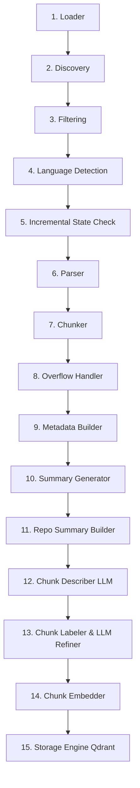

# CodeSeek Ingestion Pipeline Documentation

This document provides a comprehensive, end-to-end technical guide to the CodeSeek RAG Ingestion Pipeline. It explains how source repositories are parsed, chunked, enriched with structural and semantic metadata, embedded, and stored in the vector database to support advanced, high-recall query retrieval.

---

## 1. High-Level Ingestion Pipeline Architecture

The ingestion pipeline processes a source code repository through 15 sequential stages:



---

## 2. Ingestion Data Models (Data Contracts)

To maintain strong boundaries between parser logic, chunking algorithms, and vector indexing, the pipeline defines clear schemas passed between stages.

### A. `FileRecord` (`models/file.py`)
Tracks files discovered in the workspace.
```python
@dataclass
class FileRecord:
    path: str               # Absolute path on disk
    relative_path: str      # Path relative to repository root
    extension: str          # File extension (e.g. '.py', '.tsx')
    size_bytes: int         # Size on disk
    language: str = ""      # Detected programming language
    skipped: bool = False   # Flag to skip unsupported files
    skip_reason: str = ""   # Reason for skipping (e.g. 'unsupported_language')
```

### B. `ParsedSymbol` (`models/parsed.py`)
Encapsulates an Abstract Syntax Tree (AST) entity extracted by the parser.
```python
@dataclass
class ParsedSymbol:
    symbol_name: str        # Name of function, method, or class
    symbol_type: str        # 'function' | 'class' | 'method'
    parent_symbol: str      # Name of class if method, otherwise empty string
    start_line: int         # 1-indexed start line
    end_line: int           # 1-indexed end line
    parameters: list[str]   # Parameter names
    methods: list[str]      # Names of methods defined within (for class symbols)
    signature: str          # Complete syntax signature of the symbol
    docstring: str          # Extracted docstring block, if present
    calls: list[str]        # External symbols/calls invoked within this symbol
```

### C. `ParsedFile` (`models/parsed.py`)
The unified output returned by the AST parsing stage for a single file.
```python
@dataclass
class ParsedFile:
    relative_path: str
    language: str
    parse_status: str           # 'ok' | 'failed'
    imports: list[str]          # All raw import statements (e.g., 'import x')
    symbols: list[ParsedSymbol] # List of parsed AST symbols
```

### D. `Chunk` (`models/chunk.py`)
The ultimate data structure carried through enrichment, embedding, and database storage. 
```python
@dataclass
class Chunk:
    chunk_id: str = ""                # 32-character deterministic unique hash
    file_path: str = ""               # Absolute path on disk
    relative_path: str = ""           # Relative path from repo root
    language: str = ""                # Programming language or 'metadata'
    chunk_type: str = ""              # 'function' | 'class' | 'method' | 'file' | 'repo_summary'
    symbol_name: str = ""             # Symbol name
    qualified_symbol: str = ""        # Fully qualified name (relative_path::class.method)
    parent_symbol: str = ""           # Parent class name if applicable
    signature: str = ""               # Symbol signature
    start_line: int = 0
    end_line: int = 0
    chunk_part: int = 0               # Part number (for sliced overflow chunks)
    total_parts: int = 0              # Total parts of the sliced chunk
    token_count: int = 0              # Tiktoken count
    content: str = ""                 # Text or source code content
    embedding: list[float] = ...      # Dense vector embedding (BAAI/bge-small-en-v1.5)

    # --- AST Relationships (Crucial for Retrieval Trace-Expansion) ---
    imports: list[str] = ...          # File-level imports
    calls: list[str] = ...            # Symbols called inside this chunk
    parameters: list[str] = ...       # Chunk parameters
    methods: list[str] = ...          # Class methods (empty if not class chunk)
    file_symbols: list[str] = ...     # All symbols defined in the parent file

    # --- Declarative / Configuration File Metadata ---
    file_type: str = ""               # e.g., 'dockerfile', 'package_json', 'pyproject'
    summary_facts: list[str] = ...    # List of key configurations extracted
    detected_frameworks: list[str] = ...
    dependencies: list[str] = ...     # Production dependencies
    dev_dependencies: list[str] = ... # Dev dependencies
    scripts: dict[str, str] = ...     # Manifest script commands
    services: list[str] = ...         # Docker-compose services
    ports: list[str] = ...            # Port bindings
    env_keys: list[str] = ...         # Environment variables configured/used
    entrypoints: list[str] = ...      # App entrypoints
    config_tools: list[str] = ...     # Config tools (e.g., eslint, vite)
    build_system: str = ""            # Python or Node build systems
    volumes: list[str] = ...          # Volume bindings
    service_dependencies: dict = ...  # Compose service dependencies
    base_image: str = ""              # Docker parent image
    workdir: str = ""                 # Working directory
    package_manager: str = ""         # pnpm, npm, pip, yarn, etc.
    feature_flags: list[str] = ...    # Extracted feature flags
    provider_keys: list[str] = ...    # API keys or provider flags (e.g., OPENAI_API_KEY)
    purpose: str = ""                 # Extracted README/package description purpose
    setup_steps: list[str] = ...      # Installation commands
    usage_commands: list[str] = ...   # Usage/execution commands
    architecture_notes: list[str] = ...

    # --- Classification and Intent Metadata (For Rerank Boosts) ---
    labels: list[str] = ...                  # Selected taxonomy labels
    label_confidences: dict[str, float] = ...# Individual label scores
    code_intent: str = ""                    # Concise one-sentence behavioral description
```

---

## 3. Step-by-Step Stage Breakdown

### Stage 1: Loader (`stages/loader.py`)
* **Input**: Source string (absolute directory path or public GitHub URL).
* **Output**: Directory dictionary containing `repository_name`, `repository_root`, and `source_type`.
* **Responsibilities**: Verification of local directories or cloning remote git repositories to `/tmp` using GitPython.

### Stage 2: Discovery (`stages/discovery.py`)
* **Input**: Root directory path, pipeline counter tracker.
* **Output**: Unfiltered list of `FileRecord`s.
* **Responsibilities**: Walks the directory recursively, creating a basic metadata record for every file discovered.

### Stage 3: Filtering (`stages/filtering.py`)
* **Input**: List of `FileRecord`s, workspace root path.
* **Output**: Filtered list of processable `FileRecord`s.
* **Responsibilities**: Applies `.gitignore` specs and static system filter lists to ignore junk, test reports, binaries, hidden files, and build directories.

### Stage 4: Language Detection (`stages/language.py`)
* **Input**: Filtered list of `FileRecord`s.
* **Output**: Same list where `language` is populated; unsupported types get `skipped = True`.
* **Responsibilities**: Map extensions to supported parsers (Python, JS, TS, JSX, TSX, JSON, YAML, TOML, Markdown, etc.).

### Stage 5: Incremental State Check (`utils/state.py`)
* **Input**: Relative path, file stats.
* **Output**: Boolean indicating if file has changed.
* **Responsibilities**: Checks the stored SQLite database/JSON file signature. If a file is unchanged and the collection is not being recreated, it skips parsing to speed up indexing.

### Stage 6: Parser (`stages/parser.py`)
* **Input**: Processable `FileRecord`s.
* **Output**: `ParsedFile` instance.
* **Responsibilities**: Selects the tree-sitter language grammar based on file extension (differing between `.ts` and `.tsx` to correctly handle JSX). Walks the AST to extract imports and `ParsedSymbol` entities containing definitions, calls, parameters, and signatures.

### Stage 7: Chunker (`stages/chunker.py`)
* **Input**: `ParsedFile` and original `FileRecord`.
* **Output**: Raw list of `Chunk` objects.
* **Responsibilities**: If parsing failed, yields a single "file" fallback chunk. If successful, maps AST class, method, and function nodes to individual chunks. Methods inherit parent class scopes. File-level scopes capture lists of all definitions in `file_symbols`.

### Stage 8: Overflow Handler (`stages/overflow.py`)
* **Input**: Chunks list.
* **Output**: Slice-normalized chunks list.
* **Responsibilities**: Uses tiktoken `cl100k_base` to measure tokens. If a chunk exceeds `MAX_CHUNK_TOKENS`, it slices it into multiple parts with a sliding window (100 lines wide, 20 lines overlap) and updates `chunk_part` and `total_parts`.

### Stage 9: Metadata Builder (`stages/metadata.py`)
* **Input**: Individual `Chunk`.
* **Output**: Unique identifier-populated `Chunk`.
* **Responsibilities**: Computes the SHA-256 hash of:
  * `{relative_path}::{parent_symbol}::{symbol_name}::{chunk_part}` (for symbol chunks)
  * `{relative_path}::__file__::{chunk_part}` (for file fallback/configuration chunks)
  
  Including `parent_symbol` prevents collisions between identically-named methods in different classes (e.g. `UserService.create` vs `ProductService.create`).

### Stage 10: Summary Generator (`stages/summary.py`)
* **Input**: AST-populated `Chunk`.
* **Output**: Textual summary of code structures and configuration metrics.
* **Responsibilities**: Writes a deterministic AST summary for code files. For configuration manifest files (e.g., package.json, dockerfiles, config.js), it parses contents and extracts dependencies, env keys, scripts, build steps, and ports into `summary_facts`.

### Stage 11: Repo Summary Builder (`stages/repo_summary.py`)
* **Input**: All generated file chunks.
* **Output**: A new virtual `repo_summary` chunk.
* **Responsibilities**: Merges and ranks the most frequent dependencies, services, setup instructions, and architecture notes from files like `README.md`, `package.json`, and `.env.example` into a single global repository summary.

### Stage 12: Chunk Describer (`stages/description.py`)
* **Input**: Chunks list.
* **Output**: LLM-described chunks list.
* **Responsibilities**: (Optional) Sends eligible code chunks to a local LLM or OpenAI API to generate a highly concise 45-word behavior description.

### Stage 13: Chunk Labeler (`stages/labeler.py`)
* **Input**: Chunks list.
* **Output**: Taxonomy-labeled chunks list.
* **Responsibilities**: Labels chunks (e.g., `artifact:source-code`, `code_role:method`, `domain:auth`) using deterministic checks (import statement keywords, file suffixes). If `should_refine_labels` is true, sends chunks to LLM to add missing domain/capability tags. Derives a single-sentence `code_intent`.

### Stage 14: Chunk Embedder (`stages/embedder.py`)
* **Input**: Rich `Chunk` list.
* **Output**: Embedding-populated chunks.
* **Responsibilities**: Encodes a structural text prompt containing the file name, language, type, symbol name, AST summary, docstrings, and code contents into a dense vector using `BAAI/bge-small-en-v1.5`.

### Stage 15: Storage Engine (`stages/storage.py`)
* **Input**: Embedded chunks.
* **Output**: Upserted database records.
* **Responsibilities**: Establishes a Qdrant connection. Truncates/creates the collection if configured, parses chunk records to `PointStruct`s, serializes all attributes except vector/content as point payloads, and batch-upserts the points.

---

## 4. Metadata Mapping for Advanced Retrieval

Downstream semantic retrieval relies on structured Qdrant payloads to perform precise hybrid lookups and ranking:

| Payload Field | Extraction Stage | Retrieval Application |
| :--- | :--- | :--- |
| `chunk_id` | Metadata | De-duplication and point tracing. |
| `relative_path` | Chunker | Reranker keyword boosting; metadata filter matching. |
| `qualified_symbol` | Metadata | Enables scrolling definitions. |
| `parent_symbol` | Chunker | Resolves call traces and class methods. |
| `imports` | Chunker | Trace-expansion: finding definition chunks of imported code. |
| `calls` | Chunker | Dependency search: finding caller files. |
| `env_keys` | Summary / Metadata | Boosting config lookups. |
| `dependencies` | Summary / Metadata | Answering package version questions. |
| `labels` | Labeler | Label-aware boosts (e.g., prioritizing `class_definition` chunks for architecture queries). |
| `code_intent` | Labeler | Prompt-context synthesis. |

---

## 5. GPU & Memory Management

To support robust long-running ingestion on hardware with limited VRAM (like local GPUs), the pipeline orchestrates memory cleanup hooks in `main.py`:
* **Stage Separation**: Unloads LLMs and embeddings between description, labeling, and encoding stages if configured.
* **CUDA Cache Eviction**: Invokes `torch.cuda.empty_cache()` and `gc.collect()` after intensive stages.
* **Model Unloading**: Calls Ollama APIs to proactively unload large language models from memory (`UNLOAD_LOCAL_LLM_AFTER_INDEXING`).
